# Jadsgroup

## Workflow

## Class Diagram

---

# operation

## db table update

    npx drizzle-kit push

## seed data

    pnpm tsx src/scripts/seed.ts

---

# Non-Functional TODO

## Code Arch

Abstract features components into common components

## Optimization

add db index, redis

## PROD

### object db

- Change setting in R2, replace Public Access to Custom Domain. 
- Update CLOUDFLARE_R2_PUBLIC_URL in env file.
- Update domains in next.config.js

### other

Compress public resources.

### data clean rules

- delete invaild lease item(file, image) in 'leases' table.
