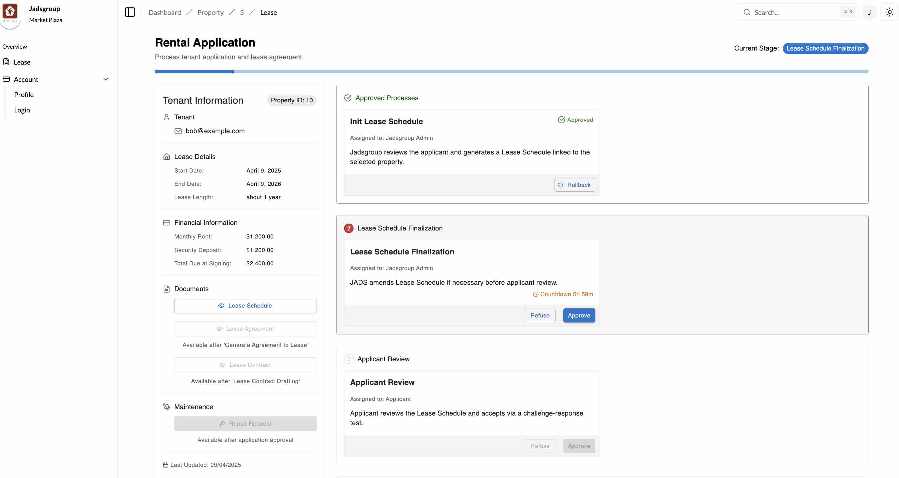
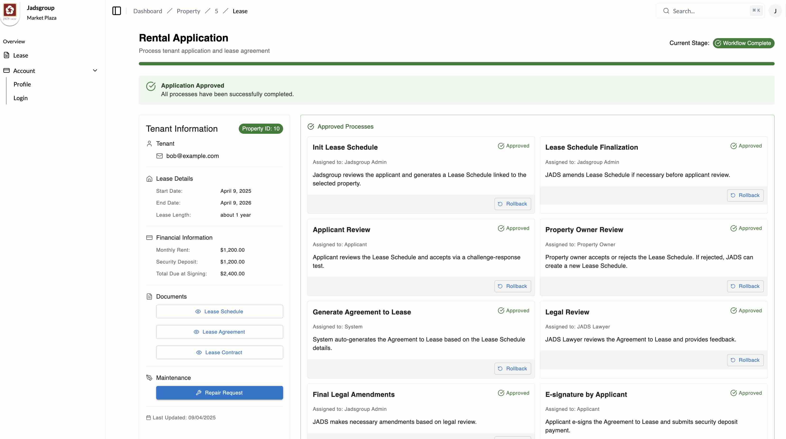

# Workflow System Design Document

## 1. System Overview

The Workflow System is a multi-stage approval platform for managing lease applications. It supports the entire process from initial application to final contract signing, enabling multi-role collaboration, status tracking, and precise workflow control.




## 2. Core Features

### 2.1 Workflow Management
- Multi-stage workflow control  
- Process status tracking  
- Automatic stage transitions  
- Workflow rollback mechanism  

### 2.2 Approval Management
- Approval of individual workflow processes  
- Rejection with reason logging  
- Rollback functionality  
- Multi-role participation  

### 2.3 Data Management
- Customer information management  
- Workflow record tracking  
- Rejection record history  
- Timestamp tracking  

### 2.4 Feature Highlights
- Property, customer, and contract data management  
- Checkbox/signature to agree to clauses  
- Text input for supplementary information  
- In-process messaging  
- Document generation (field replacement or full generation)  

## 3. System Architecture

### 3.1 Frontend Architecture
- React-based frontend  
- Material-UI component library  
- Responsive layout design  
- Real-time state updates  

### 3.2 Data Flow
- Client-side state management  
- Server-side data synchronization  
- Real-time update mechanism  
- Error handling mechanisms  

## 4. Core Components

### 4.1 Page Components
- `WorkflowPage`: Main workflow page  
- `WorkflowHeader`: Header navigation  
- `ProcessList`: Process list component  
- `CustomerInfoPanel`: Customer info panel  

### 4.2 State Management
- Customer data state  
- Process state  
- Workflow state  
- Loading state  
- Error state  

## 5. Workflow Stages

The system contains **9 primary stages** and **1 final completion state**:

### 5.0 Application Form

Every application form have a folder named by user.email to store object file.

Regularly delete the abandoned order folder, and store vaild folder forever.

todo: file name rules

### 5.1 Jadsgroup Initial Review
### 5.2 Lease Schedule Finalization
### 5.3 Applicant Review
### 5.4 Property Owner Review
### 5.5 Generate Agreement to Lease
### 5.6 Legal Review
### 5.7 E-sign & Payment
### 5.8 Lease Contract Drafting
### 5.9 Final Documentation Review
### 5.10 finished

## 6. Data Models

### 6.1 Customer Model
```typescript
interface Customer {
    property_id: number
    tenant_email: string
    start_date: Date
    end_date: Date
    rent_amount: number
    deposit_amount: number
    stage: string
    agreement_to_lease: string
}
```

### 6.2 Process Model
```typescript
interface Process {
    id: string
    name: string
    description: string
    state: ProcessState
    createdAt: string
    assignedTo: string
    refusalRecords?: RefusalRecord[]
    originalStage?: WorkflowState
    stageId: WorkflowState
}
```

### 6.3 Refusal Record
```typescript
interface RefusalRecord {
    reason: string
    timestamp: string
}
```

## 7. State Management

### 7.1 Workflow States
```typescript
type WorkflowState = "s1" | "s2" | "s3" | "s4" | "s5" | "s6" | "s7" | "s8" | "s9" | "finished"
```

### 7.2 Process States
```typescript
type ProcessState = WorkflowState | "approved" | "refused"
```

## 8. Core Functional Implementation

### 8.1 Process Approval
- Approve individual processes  
- Automatically check if current stage is complete  
- Automatically proceed to the next stage  
- Handle errors and rollback if necessary  

### 8.2 Process Rejection
- Log rejection reasons  
- Add timestamps to records  
- View historical rejections  
- Trigger appropriate state updates  

### 8.3 Process Rollback
- Roll back to original stage  
- Validate workflow consistency  
- Update workflow states accordingly  
- Handle any rollback exceptions  

## 9. User Actions

Users can take the following actions on a process at any stage:

- **approve**  
- **refuse**  
- **restart**  
- **rollback**

## 10. Permission Management

The system uses role-based access control to ensure each stage is handled by the appropriate role.

### 10.1 Roles and Permissions

- **Applicant (LESSEE)**  
  - The only role allowed to self-register  
  - Can only manage their own workflow  
  - Can only act when the process is in their approval stage  

- **Admin (JADS)**  
  - Full access to all workflows  
  - Can advance, roll back, restart workflows  
  - Can assign workflows, modify templates, and audit logs  

- **Property Owner (LESSOR)**  
  - Can only act on workflows involving their own properties  
  - Responsible for reviewing and approving lease agreements  

- **JAD’s Lawyers (JADS LAW)**  
  - Can edit legal review stage  
  - Add annotations, suggestions, and mark documents ready for signing  

- **Land Agents (AGENT)**  
  - Assign customers  
  - Advance Lease Schedule phase  
  - Can view workflows assigned to them  

- **Accounts (MONEY)**  
  - View payment status  
  - Upload/verify payment receipts  
  - Handle rent confirmation during E-sign & Payment stage  

> Note: Only Applicants can register themselves. All other roles must be created by Admin through the backend.

## 11. User Interface

### 11.1 Layout Design
- Responsive grid-based UI  
- Left: customer info panel  
- Right: workflow process list  
- Top: navigation bar  

### 11.2 Status Display
- Loading indicators  
- Error messages  
- Completion prompts  
- Real-time updates  

## 12. Error Handling

- Handle data loading failures  
- Handle operation errors  
- Show user-friendly messages  
- Support rollback on errors  

## 13. Performance Optimization

- Periodic refresh  
- Local state caching  
- Bulk data processing  
- Async operations  

## 14. Security Considerations

- Role-based permission control  
- Input validation  
- Operation logging  
- Workflow consistency enforcement  

## 15. Extensibility Considerations

- Modular system design  
- Configurable workflow logic  
- Scalable state management  
- Flexible process definitions

